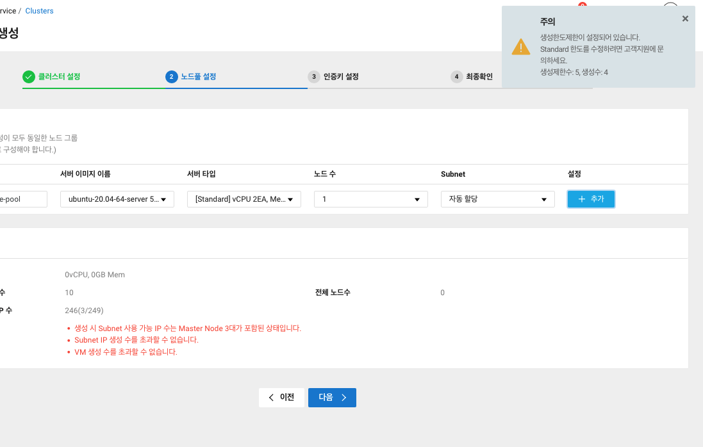

# Cloud Club 2기 프로젝트

## 2주차 목표

- Naver Cloud Platform(NCP)를 활용하여 k8s resource 생성하고 사용해보기

## 생성제한에 걸림 😂

- 그럼 이번주는 저번주에 사용해보지 못한 k8s 리소스들을 사용해보자

## ServiceAccount

### default ServiceAccount

- 클러스터 생성시 기본적으로 default 서비스 어카운트가 생성되어 있음을 확인

~~~bash
$ kubectl get sa
NAME      SECRETS   AGE
default   0         2m9s 
~~~

- Pod 생성시 서비스어카운트를 지정해주지 않으면 기본 서비스어카운트가 자동으로 세팅

~~~bash
$ kubectl run --image=nginx nginx

# 마운트 한적 없는 볼륨이 마운트 되어있는 것이 확인됨
$ kubectl describe pod nginx
...
Mounts:
  /var/run/secrets/kubernetes.io/serviceaccount from kube-api-access-8mfcz (ro)
...
Volumes:
  kube-api-access-8mfcz:
    Type:                    Projected (a volume that contains injected data from multiple sources)
    TokenExpirationSeconds:  3607
    ConfigMapName:           kube-root-ca.crt
    ConfigMapOptional:       <nil>
    DownwardAPI:             true
...

# 해당 경로 확인
$ kubectl exec -it nginx -- ls /var/run/secrets/kubernetes.io/serviceaccount
ca.crt  namespace  token

# 토큰 확인
$ kubectl exec -it nginx -- cat /var/run/secrets/kubernetes.io/serviceaccount/token
eyJhbGciOiJSUzI1NiIsImtpZCI6ImNlU0JVOHowRXFzak1HckpWSUpSSWN6c3VlZlpoNmVQRVl...
~~~

- automountServiceAccountToken 옵션을 false로 지정하면 default ServiceAccount가 마운트되지 않음
~~~yaml
apiVersion: v1
kind: Pod
metadata:
  labels:
    run: nginx
  name: nginx
spec:
  containers:
  - image: nginx
    imagePullPolicy: Always
    name: nginx
  automountServiceAccountToken: false
~~~

~~~bash
$ kubectl apply -f nginx.yaml

# 확인
$ kubectl describe pod nginx                                                       
...
Mounts:         <none>
Volumes:            <none>
~~~

### Custom ServiceAccount

- default ServiceAccount에는 부여된 권한이 제한적
- 직접 ServiceAccount를 생성하여 원하는 권한을 부여할 수 있음

~~~yaml
apiVersion: v1
kind: ServiceAccount
metadata:
  namespace: default
  name: test
---
apiVersion: rbac.authorization.k8s.io/v1
kind: Role
metadata:
  namespace: default
  name: custom-role
rules:
- apiGroups: [""]
  resources: ["pods"]
  verbs: ["get", "watch", "list"]
---
apiVersion: rbac.authorization.k8s.io/v1
kind: RoleBinding
metadata:
  namespace: default
  name: custom-rolebinding
subjects:
- kind: ServiceAccount
  name: test
roleRef:
  kind: Role
  name: custom-role
  apiGroup: rbac.authorization.k8s.io
~~~

~~~bash
$ kubectl apply -f sa-test.yaml
serviceaccount/test created
role.rbac.authorization.k8s.io/custom-role created
rolebinding.rbac.authorization.k8s.io/custom-rolebinding created
~~~

- Pod에 ServiceAccount 지정
~~~yaml
apiVersion: v1
kind: Pod
metadata:
  labels:
    run: nginx
  name: nginx
spec:
  containers:
  - image: nginx
    imagePullPolicy: Always
    name: nginx
  serviceAccountName: test
~~~

~~~bash
$ kubectl apply -f nginx-sa.yaml 

$ kubectl describe pod nginx
...
Mounts:
    /var/run/secrets/kubernetes.io/serviceaccount from kube-api-access-jghfl (ro)
...
Volumes:
  kube-api-access-jghfl:
    Type:                    Projected (a volume that contains injected data from multiple sources)
    TokenExpirationSeconds:  3607
    ConfigMapName:           kube-root-ca.crt
    ConfigMapOptional:       <nil>
    DownwardAPI:             true
...

# 토큰 생성 확인
kubectl exec -it nginx -- cat /var/run/secrets/kubernetes.io/serviceaccount/token
eyJhbGciOiJSUzI1NiIsImtpZCI6ImNlU0JVOHowRXFzak1HckpWSUpSSWN...
~~~