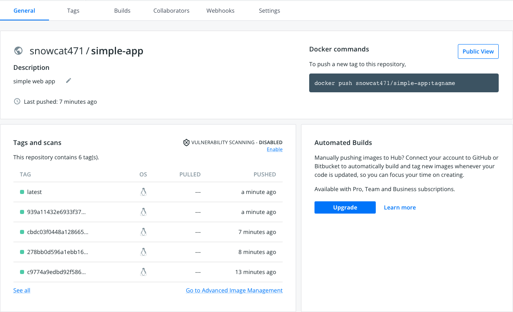
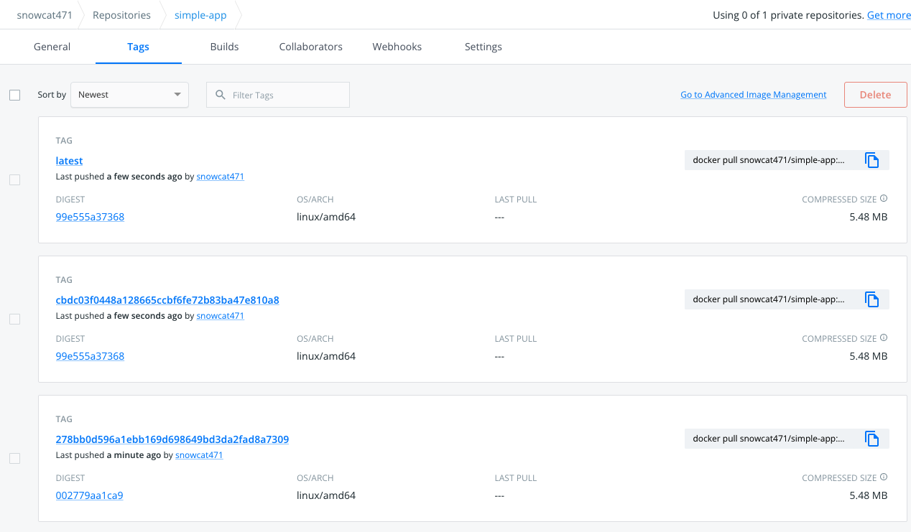

# Cloud Club 2기 프로젝트

## 1주차

### 목표

- Github Repository 구성
- 해당 브랜치에 Push 발생시 Image 빌드하여 Docker Hub에 Push

### 1. Docker Build

~~~docker
# Build Stage
FROM golang:1.19.0-alpine3.16 AS builder

WORKDIR /app
COPY ./src .

ENV GO111MODULE=on

RUN go get 
RUN CGO_ENABLED=0 GOOS=linux GOARCH=amd64 go build -a -ldflags="-s -w" -o app .

# Execute Stage
FROM alpine

WORKDIR /app
COPY --from=builder /app .

ENTRYPOINT [ "./app" ]
~~~

- Build Stage
  - golang:1.19.0-alpine3.16 에서 빌드
  - ldflag 옵션
    - -w : DWARF debugging 정보 off
    - -s : Go symbol 테이블 생성 off
- Running Stage
  - 실제로 binary 파일을 실행하는 stage
  - alpine 이미지를 사용하여 docker image 사이즈를 줄임

### 2. Docker Image Push On DockerHub

참고 : https://github.com/marketplace/actions/build-and-push-docker-images

- .github/workflows/deploy-week-1.yaml
~~~yaml
name: Build and Push Image

on:
  push:
    branches: [ "week-1" ]

env:
  IMAGE_NAME: simple-app

jobs:
  build:
    runs-on: ubuntu-latest

    steps:
      - name: Checkout repository
        uses: actions/checkout@v3

      - name: Set up QEMU
        uses: docker/setup-qemu-action@v2

      - name: Set up Docker Buildx
        uses: docker/setup-buildx-action@v2

      - name: Docker Login
        uses: docker/login-action@v2.0.0
        with:
          username: ${{ secrets.DOCKER_HUB_USER }}
          password: ${{ secrets.DOCKER_HUB_PASSWORD }}

      - name: Build and Push Image
        uses: docker/build-push-action@v3
        with:
          push: true
          tags: ${{ secrets.DOCKER_HUB_USER }}/${{ env.IMAGE_NAME }}:${{ github.sha }}
~~~

### 3. 해당 branch에 코드 push 후 빌드 결과 확인

